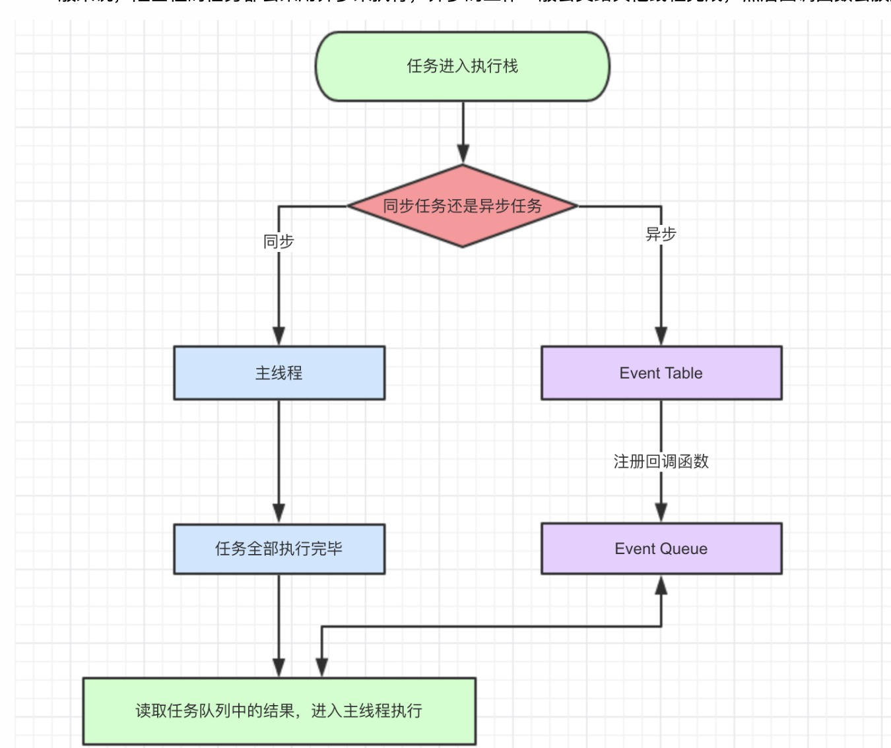

# 一、宏任务(macrotask)
> 可以理解是每次执行栈执行的代码就是一个宏任务(包括每次从事件队列中获取一个事件回调并放到执行栈中执行)。主要场景有：主代码块、setTimeout、setInterval等
### 宏任务有：
- 同步代码 (浏览器、Node)
- UI rendering (浏览器、Node)
- I/O (浏览器、Node)
- setTimeout (浏览器、Node)
- setInterval (浏览器、Node)
- requestAnimationFrame (浏览器)
- setImmedite (Node)
### 任务执行优先级：
主代码块 > setImmediate > MessageChannel > setTimeout / setInterval 
> 大部分浏览器会把DOM事件回调优先处理 因为要提升用户体验 给用户反馈，其次是network IO操作的回调，再然后是UIrender，之后的顺序就难以捉摸了，其实不同浏览器的表现也不太一样

# 二、微任务(microtask)
> 当所有同步任务执行完成后立即执行的任务
### 微任务有：
- Process.nextTick (Node)
- Promise (浏览器、Node)
- mutationObserver (浏览器)
### 任务执行优先级：
process.nextTick > Promise = MutationObserver

# 三、Event Loop
> 计算机系统的一种运行机制。JavaScript语言就采用这种机制，来解决单线程运行带来的一些问题

 ### 异步执行的运行机制如下
 > 同步任务也如此，因为它可以被视为没有异步任务的异步执行
- 1、所有同步任务都在主线程上执行，形成一个执行栈(execution context stack)
- 2、主线程之外，还存在一个*任务队列*，只要异步任务有了运行结果，就在*任务队列*之中放置一个事件
- 3、一旦*执行栈*中的所有同步任务执行完毕，系统就会读取*任务队列*，看看里面有哪些事件。那些对应的异步任务，于是结束等待，进入执行栈，开始执行
- 4、主线程不断重复3步骤