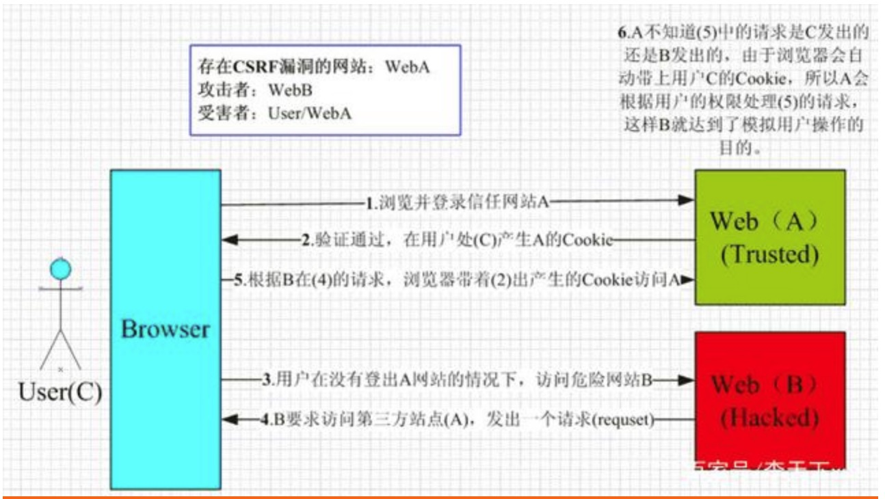

# CSRF 
> Cross-site request forgery : 跨站请求伪造

# XSS 
> Cross Site Scripting : 跨域脚本攻击 
XSS攻击的核心原理是：不需要你做任何的登录认证，它会通过合法的操作（比如在url中输入、在评论框中输入），向你的页面注入脚本（可能是js、hmtl代码块等），从而盗用Cookie破坏页面的正常结构，或者发起插入广告等恶意内容D-doss攻击

